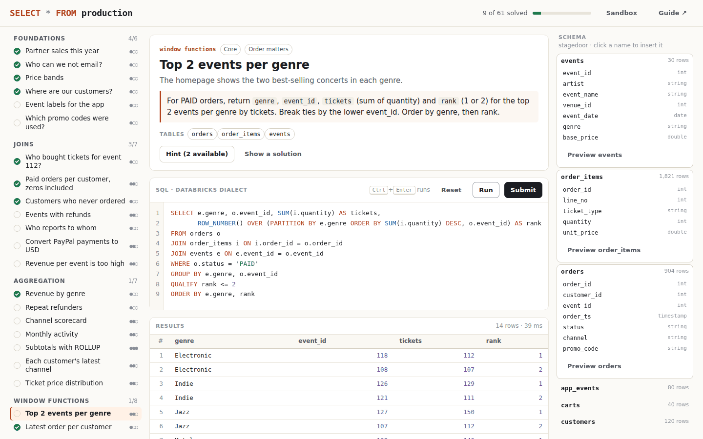

# SELECT * FROM production

**Intensive Databricks SQL practice: 61 graded challenges built from real production work, running in your browser.**

[](https://aboualyxcode.github.io/select-from-production/)
[](https://github.com/aboualyXcode/select-from-production/actions/workflows/test.yml)


Every challenge is a request from a team at Stagedoor, a fictional concert-ticketing company. The data is as messy as production data: duplicate charges, refunds for orders that don't exist, malformed sign-ups, JSON events, nested carts and gaps in daily snapshots. You write Databricks SQL, run it, and submit it for grading. When you get it right, you learn why it matters and see another way to write it.

**[▶ Start practising](https://aboualyxcode.github.io/select-from-production/)**



## Contents

- [Quick start](#quick-start)
- [What you'll practise](#what-youll-practise)
- [How grading works](#how-grading-works)
- [The dataset](#the-dataset)
- [Running on Databricks](#running-on-databricks)
- [The guide](#the-guide)
- [The engine](#the-engine)
- [Repository structure](#repository-structure)
- [Testing](#testing)
- [Contributing a challenge](#contributing-a-challenge)
- [Credits](#credits)

## Quick start

**In the browser:** open [aboualyxcode.github.io/select-from-production](https://aboualyxcode.github.io/select-from-production/). Nothing to install, no account. Progress is saved in your browser.

**Locally:** clone the repository and open `index.html`, or serve the folder:

```sh
git clone https://github.com/aboualyXcode/select-from-production.git
cd select-from-production
python3 -m http.server 8000      # then open http://localhost:8000
```

**On a real Databricks workspace:** see [Running on Databricks](#running-on-databricks).

## What you'll practise

| Track | Challenges | Highlights |
|---|---|---|
| Foundations | 6 | Filtering, NULLs, CASE, string and date formatting, LIKE and ILIKE |
| Joins | 7 | Zero-count rows, `LEFT ANTI` / `LEFT SEMI JOIN`, self joins, range joins, fan-out |
| Aggregation | 7 | `GROUP BY ALL`, `FILTER (WHERE …)`, `count_if`, `ROLLUP`, `max_by`, percentiles |
| Window functions | 8 | Top-N with `QUALIFY`, deduplication, running totals, month-over-month, frames, `NTILE` |
| Data quality | 6 | Duplicate charges, cleaning raw sign-ups, `try_cast`, orphans, NULL-safe comparison |
| Dates and time series | 7 | Zero-filling, gaps and islands, sessionization, cohorts, SLAs |
| Semi-structured data | 5 | JSON paths, `from_json`, `explode` / `inline`, higher-order functions |
| Pipelines and MERGE | 6 | Upserts, deduplicating a MERGE source, SCD Type 2, idempotent incremental loads |
| Hierarchies | 3 | `WITH RECURSIVE` over an org chart and referral chains |
| Incidents | 6 | `NOT IN` with NULLs, averages of averages, `UNION` losing money, net revenue, a KPI capstone |

Each challenge is labelled warm-up, core or hard. Hints unlock one at a time, and a reference solution is available after you've tried.

## How grading works

- **Queries** are graded by comparing your result with the expected result as a multiset of rows, or row by row when the task specifies an order. Any correct query passes, however you write it. Numbers are compared to 4 decimal places.
- **Pipeline challenges** run your statements against a prepared setup, then compare the resulting table. Those marked *idempotent* are run twice, because production jobs get retried.
- **Feedback** shows the expected rows you're missing and the unexpected rows you returned, and flags likely join fan-out when your result contains duplicates.
- **Errors** appear with their Databricks error class (`MISSING_AGGREGATION`, `AMBIGUOUS_REFERENCE`, `DIVIDE_BY_ZERO`, …) and message, as they would on a SQL warehouse.

## The dataset

Fifteen tables, about 5,400 rows, generated deterministically:

| Table | Rows | Notes |
|---|---|---|
| `customers` | 120 | Missing emails, self-referencing `referred_by` |
| `venues`, `events` | 10, 30 | Concerts across ten cities |
| `orders`, `order_items` | 904, 1,821 | PLACED, PAID, CANCELLED, REFUNDED |
| `payments` | 781 | Duplicate charges and declined-then-retried attempts |
| `refunds` | 101 | Including one for an order that doesn't exist |
| `page_views` | 1,251 | Clickstream with anonymous visitors |
| `support_tickets` | 150 | Open and closed, four priorities |
| `employees` | 20 | An org chart for recursive queries |
| `seat_inventory` | 109 | Daily snapshots with missing days |
| `raw_signups` | 10 | Untrimmed, mixed-case, invalid and duplicate entries |
| `app_events` | 80 | JSON payloads with nested arrays |
| `carts` | 40 | `ARRAY<STRUCT<…>>` line items, some empty |
| `fx_rates` | 8 | Exchange rates valid over date ranges |

The lab's "today" is fixed at 2026-07-01, so answers never change with the calendar.

## Running on Databricks

The [`databricks/`](databricks/) folder contains the same material for a real workspace:

1. Run [`databricks/00_create_dataset.sql`](databricks/00_create_dataset.sql) in the SQL editor or a notebook. It creates the schema `stagedoor` with all fifteen tables.
2. Open any file in [`databricks/challenges/`](databricks/challenges/): the brief, any setup, and space for your SQL.
3. Compare with [`databricks/solutions/`](databricks/solutions/): the reference solution, an alternative and the lesson.

These files are generated from the playground by `node tools/export-databricks.js`, and a test runs every generated solution file to make sure it matches the playground.

## The guide

Eight chapters in [`docs/`](docs/) explain the ideas behind the challenges:

1. [How a query runs](docs/01-how-a-query-runs.md): evaluation order, NULL logic, ANSI mode, error classes
2. [Joins](docs/02-joins.md): semi and anti joins, filter placement, fan-out, range joins
3. [Aggregation and window functions](docs/03-aggregation-and-windows.md): grain, frames, QUALIFY
4. [Data quality and time series](docs/04-data-quality-and-time.md): validation, deduplication, calendars, sessions
5. [Semi-structured data](docs/05-semi-structured-data.md): JSON, from_json, explode, higher-order functions
6. [Pipelines and MERGE](docs/06-pipelines-and-merge.md): MERGE rules, SCD Type 2, idempotency, incremental loads
7. [Performance on Databricks](docs/07-performance-on-databricks.md): data skipping, clustering, joins, the query profile
8. [About the engine](docs/08-about-the-engine.md): what's supported, what isn't, how it's verified

## The engine

No browser engine speaks Databricks SQL, so the playground includes its own: a Databricks-compatible SQL engine in plain JavaScript (`js/sql/`), with no dependencies.

- **Query features:** joins including `LEFT SEMI`/`LEFT ANTI`; `GROUP BY ALL`, `QUALIFY`, `FILTER`, `ROLLUP`/`CUBE`, window functions with frames, correlated subqueries and recursive CTEs.
- **Nested data:** arrays, structs and maps, lambdas, `explode`/`inline`/`LATERAL VIEW`, and JSON paths.
- **Changing data:** `MERGE` with Delta's semantics, plus the rest of the DML and DDL.
- **Behaviour:** about 150 built-in functions, ANSI mode as on SQL warehouses, and Databricks error classes with suggestions.

It is verified four ways: 101 queries differential-tested against SQLite, 104 Databricks-specific checks taken largely from the SQL reference's examples, cross-checked solutions for every challenge, and an end-to-end test of the generated Databricks files. [Chapter 8](docs/08-about-the-engine.md) lists exactly what it does and doesn't support.

## Repository structure

```
index.html, css/, js/ui.js     the playground
js/sql/parser.js               lexer and parser for the Databricks SQL subset
js/sql/functions.js            types, ANSI casting, ~150 scalar, aggregate and window functions
js/sql/engine.js               planner and executor: joins, grouping, windows, subqueries, DML, MERGE
js/data.js                     the deterministic Stagedoor dataset
js/grader.js                   result-set and table-state grading, including idempotency
js/challenges-1.js, -2.js      the 61 challenges and 10 tracks
databricks/                    dataset script, challenges and solutions for a real workspace (generated)
docs/                          the guide
tools/export-databricks.js     generates databricks/
tests/                         engine, SQLite differential, challenge and export tests
```

## Testing

```sh
node tests/engine.test.js              # Databricks-specific behaviour (104 checks)
python3 tests/differential_sqlite.py   # 101 queries must match SQLite exactly
node tests/challenges.test.js          # every challenge: solution, alternative, traps, idempotency
node tests/databricks-export.test.js   # generated Databricks files reproduce the playground
```

No dependencies beyond Node.js and Python 3. GitHub Actions runs all four on every push, and also fails if `databricks/` is out of date.

## Contributing a challenge

Challenges are plain objects in `js/challenges-1.js` and `js/challenges-2.js`:

```js
{
  id: 'my-challenge', level: 2, title: 'Short title',
  scenario: 'Who is asking, and why.',
  task: 'Exactly what to return: columns, filters, rounding and order.',
  tables: ['orders'], ordered: true,
  hints: ['A nudge.', 'A bigger nudge.'],
  solution: `SELECT …`,
  alt: `SELECT …`,                  // written differently; tests require the same result
  traps: [`SELECT …`],              // classic wrong answers; tests require them to fail
  explain: 'Why it matters in production.',
}
```

For data-changing challenges, add `mode: 'state'`, a `setup` script, a `check` query, and `idempotent: true` where a rerun must be safe. Then run `node tests/challenges.test.js my-challenge` and `node tools/export-databricks.js`.

Good challenges come from real incidents: state the business request, make the task unambiguous (columns, order, rounding), and add the trap you've seen people fall into.

## Credits

Created by [Mahmoud Aboualy](https://github.com/aboualyXcode). Part of a series with [Desired State](https://github.com/aboualyXcode/k8s-desired-state), [Blast Radius](https://github.com/aboualyXcode/k8s-blast-radius) and [Lakehouse Modeling Lab](https://github.com/aboualyXcode/lakehouse-modeling-lab).

Typefaces: Instrument Sans and JetBrains Mono from Google Fonts. Stagedoor and its customers are fictional.

Databricks and Delta Lake are trademarks of Databricks, Inc. This project is independent and not affiliated with or endorsed by Databricks.
